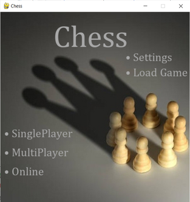
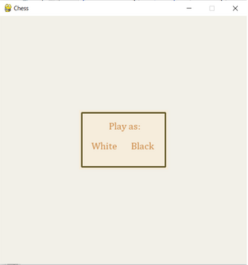
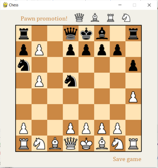
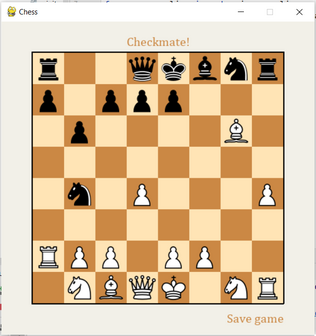
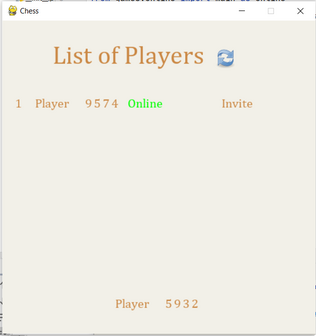
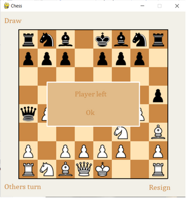

# Chess-Game
A SinglePlayer, Multiplayer and Online Chess Game implemented using pygame library.

For singleplayer and multiplayer modules run main.py.
For online module, enter ipv4 address in main.py where specified and instances of server.py and main.py.

# Instructions
Before starting a game, from the main manu personalize settings as True or False for Flipping the Board (only in Multiplayer and Online modules) and Show Moves (available for all modules). If you do not want to initialize a neew game, you can load a singleplayer or mulyiplayer saved game from Load Game module.

If playing in singleplayer module, you can choose to play with white or black against ia.

Features implemented in singleplayer and multiplayer modules: save game, load game.

When entering online module, wait in the lobby for other players to join and refresh the list. Send invitation to play to active players. 

Features implemented in online module: draw and resign.

